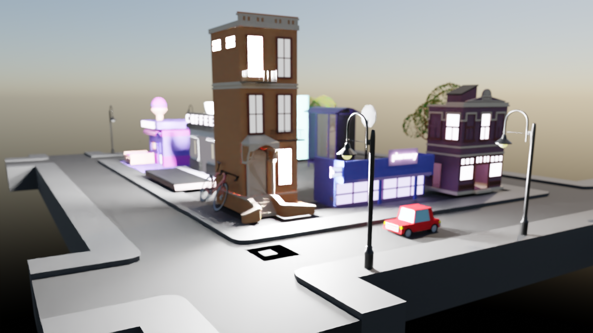
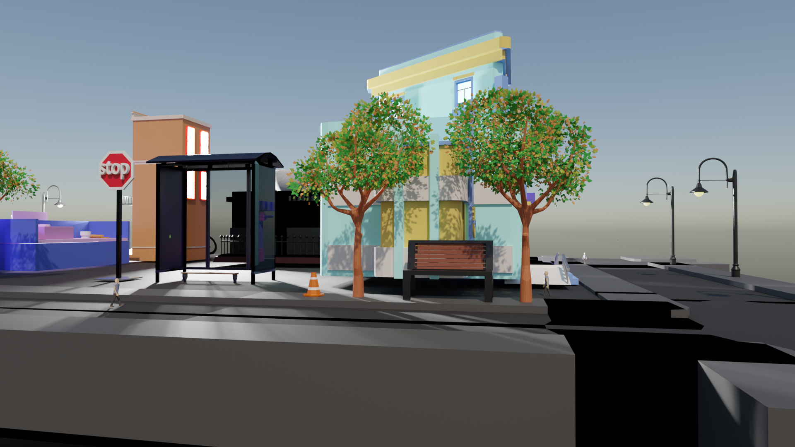
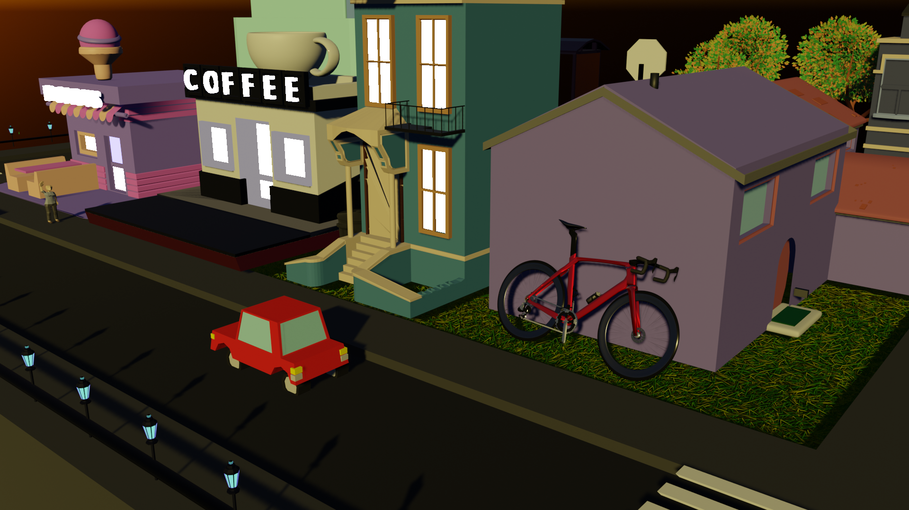
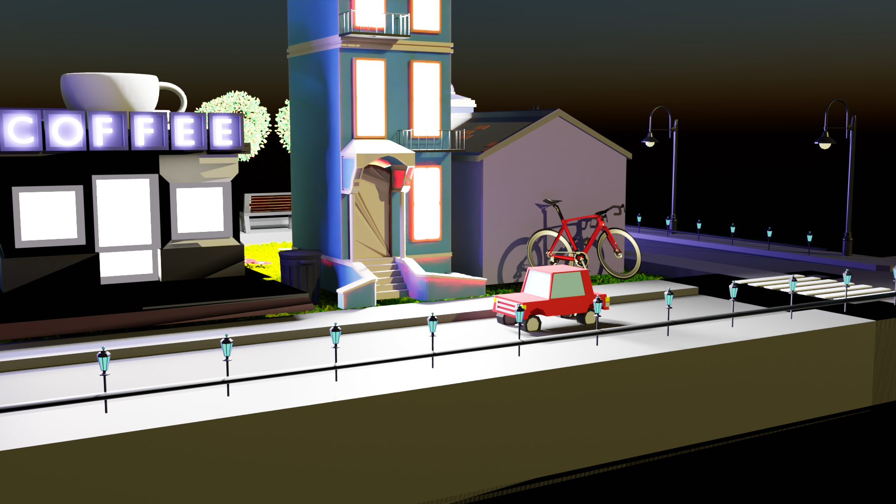
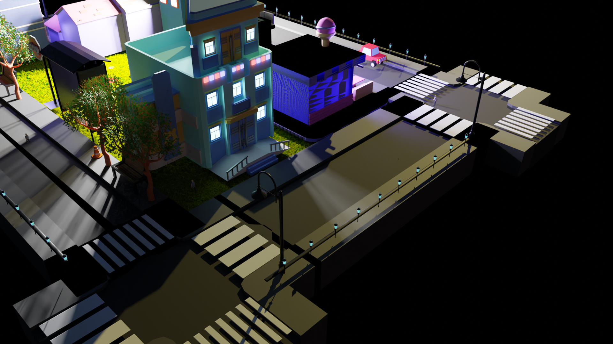

   
---

# 🏙️ Poly City Project

Welcome to the **Poly City Project**, a creative exploration into the world of 3D modeling, animation, and rendering using Blender. This project showcases a vibrant, low-poly cityscape brought to life with a combination of design techniques and lighting effects.

## 📍 Concepts Applied

- **🛠️ 3D Modeling & Design**  
  Crafted the foundational structures and elements of the city, focusing on low-poly design principles to maintain a stylized, yet detailed aesthetic.

- **🎨 Adding Colors and Texture**  
  Applied a unique palette and textures to enhance the visual appeal, bringing out the character and vibrancy of the city.

- **🌅 HDRI Lighting**  
  Utilized High Dynamic Range Imaging (HDRI) to create realistic lighting environments, adding depth and realism to the scene.

- **🎥 Animation**  
  Animated various elements within the city, from traffic movement to lighting changes, to create a dynamic and engaging urban landscape.

- **📸 Rendering (Images + Shots)**  
  Captured high-quality images and cinematic shots using both `Cycle` and `Eevee Engines` rendering that highlight the best aspects of the city design, ensuring a polished final presentation.

## _Some Images_

